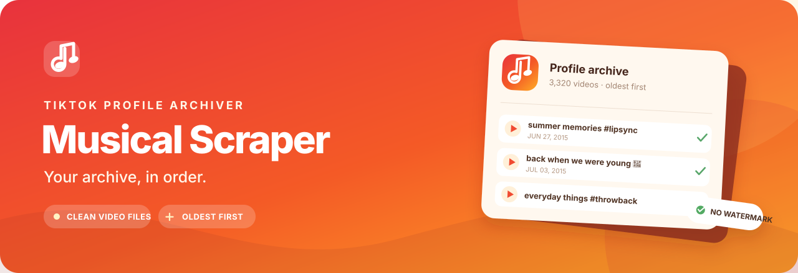

<div align="center">



<br>

<a href="https://github.com/hesm4tt/MusicalScraper/releases/latest"></a>
<a href="https://github.com/hesm4tt/MusicalScraper/actions/workflows/release.yml"></a>
<a href="LICENSE"></a>


<br><br>

<a href="https://github.com/hesm4tt/MusicalScraper/releases/latest/download/MusicalScraper-macOS.zip"><strong>↓ Download for macOS</strong></a>
&nbsp;&nbsp;·&nbsp;&nbsp;
<a href="https://github.com/hesm4tt/MusicalScraper/releases/latest/download/MusicalScraper-Windows.zip"><strong>↓ Download for Windows</strong></a>
&nbsp;&nbsp;·&nbsp;&nbsp;
<a href="https://github.com/hesm4tt/MusicalScraper/releases">All releases</a>

</div>

Musical Scraper saves a TikTok profile's public videos as MP4s, watermark-free and oldest
first. Files use the video caption, with optional hashtags, and keep their original upload
dates so an archive stays in order.

## What you can do

| | |
|---|---|
| **Browse the full back catalogue** | Scan a profile's history, including older musical.ly-era posts that the standard yt-dlp profile listing can miss. |
| **Keep videos in order** | Sort oldest-first, filter by date, and stamp files with the original upload date. |
| **Name files your way** | Use captions, add hashtags, and optionally number files for an upload sequence. |
| **Preview before saving** | See the planned filenames first. Repeat a download later to continue where you left off. |
| **Use a desktop app or CLI** | Download the macOS app or Windows executable, or run the command line version from source. |

## Get started

### Desktop app

1. Download the build for your computer using the buttons above and unzip it.
2. On macOS, move **Musical Scraper.app** to Applications. On Windows, open **MusicalScraper.exe**.
3. Enter a TikTok username, choose a folder, then select **Preview** or **Download**.

The app starts with a batch of the next 25 oldest videos not already in the archive. Choose
**Everything** to download the rest. The first full profile scan usually takes a minute or two;
the listing is cached for 24 hours.

<details>
<summary>First launch on macOS or Windows</summary>

The release builds are not signed with paid developer certificates, so the operating system
may show a first-launch warning.

- **macOS:** Control-click the app, choose **Open**, then confirm. If needed, go to
  **System Settings → Privacy & Security → Open Anyway**.
- **Windows:** choose **More info → Run anyway** in SmartScreen.

</details>

### Command line

From a source checkout, install dependencies once and preview a profile:

```bash
./setup.sh
./musical-scraper @username --dry-run
```

Download the next 25 oldest videos and add an archive hashtag:

```bash
./musical-scraper @username --limit 25 --tag MyArchive
```

By default, files look like `video caption #MyArchive #username.mp4`. Omit `--tag` for no
extra hashtag, or pass `--no-user-tag` to leave out the username tag too.

| Option | Description |
|---|---|
| `--dry-run` | Preview filenames without downloading. |
| `--limit N` / `--skip N` | Download N remaining videos or skip the next N. |
| `--since DATE` / `--until DATE` | Filter by date (`YYYY-MM-DD`). |
| `--tag NAME` | Add a hashtag to filenames; repeat the option for multiple tags. |
| `--tag-user NAME` / `--no-user-tag` | Change or omit the username hashtag. |
| `--number` | Prefix filenames with their upload order. |
| `--newest-first` | Reverse the default oldest-first order. |
| `--codec best` | Prefer the highest available resolution; may select H.265. |
| `--refresh` | Re-scan instead of using the cached profile listing. |
| `--cookies-from-browser chrome` | Use a logged-in browser session if TikTok restricts access. |

Run `./musical-scraper --help` for all options.

## How it works

TikTok provides a clean playback stream separately from the watermarked save-video stream.
Musical Scraper selects the clean stream directly; it does not crop, blur, or re-encode the
video. For profile listings, it walks the account history using dated API cursors, which can
reach older posts missed by the default yt-dlp listing. The list and download archive are
cached locally so you can resume later.

Each output folder includes a `manifest.csv` with full captions, video URLs, dates, and
download status. Filenames are shortened when needed to stay within common filesystem limits;
the manifest keeps the full caption. See [How it works](docs/how-it-works.md) for notes on
profile scanning, format selection, and local archive files.

## Build from source

Release builds use Python 3.13. Build on the platform you want to package for: PyInstaller
does not cross-compile between macOS and Windows.

```bash
./setup.sh
./build.sh
```

GitHub Actions builds both desktop packages when a `v*` tag is pushed. See
[CONTRIBUTING.md](CONTRIBUTING.md) for the development workflow.

See [CHANGELOG.md](CHANGELOG.md) for release history.

## Responsible use

Use Musical Scraper for videos you own or have permission to archive. Respect creators'
rights, privacy settings, and TikTok's terms. Downloading a video does not grant permission to
repost it elsewhere.

## License

[MIT](LICENSE)
